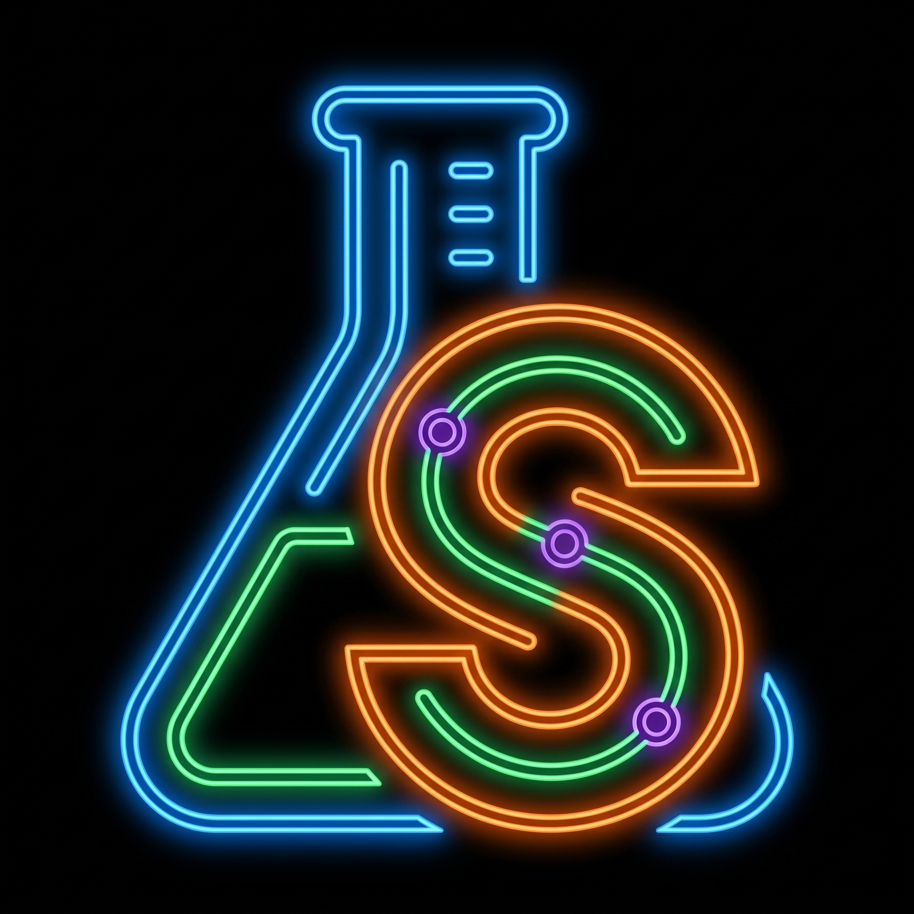
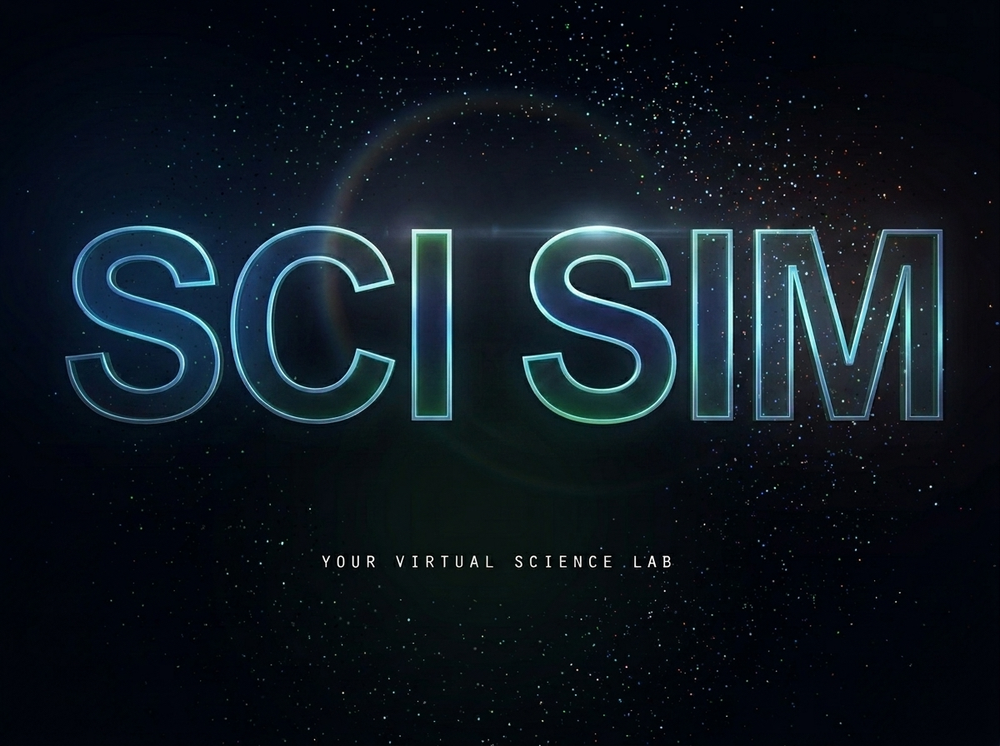
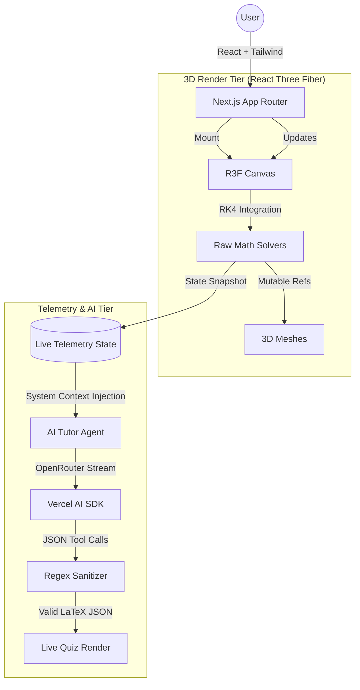

<div align="center">
  
  
  # Sci Sim
  ### The Context-Aware Autonomous WebGL Laboratory
  
  <div align="center">
    
    <div style="background: #09090b; padding: 20px; border-radius: 12px; border: 1px solid #1e293b; margin-top: 15px;">
      <h3 style="color: #818cf8; margin: 0;">Interactive 60FPS Physics • Omniscient AI Tutor • Real-time Telemetry</h3>
    </div>
  </div>  
  <br />

  **Built for the ultimate interactive education experience.**
  
  <div align="center">
    <a href="https://sci-sim.vercel.app/lab/physics">
      
    </a>
    <a href="https://youtu.be/PlrZKpREpgk">
      
    </a>
  </div>
  <br/>

  [](#)
  [](#)
  [](#)
  [](#)
  [](#)
</div>

<br/>

> **Science education is fundamentally broken.** Reading about the Runge-Kutta mathematical method or viewing a static 2D pendulum gif is incredibly unengaging. 

There are hundreds of science simulation websites on the internet. But they are almost all entirely static—if a student doesn't understand the complex mathematics happening on screen, they are left behind.

**Sci Sim collapses the entire laboratory into the browser and gives it a brain.** 

Sci Sim is the world's first **Context-Aware Autonomous WebGL Laboratory**. Students get to interact with beautifully lit 3D environments (pouring titrants, firing parabolic cannons). But the true magic is the **Omniscient AI Tutor** that acts as the core of the application. The AI Tutor has "eyes" on your simulation. It ingests your live telemetry in real-time (pH levels, trajectory angles, velocities, kinetic energy). It doesn't just act like a generic chatbot; it actually knows that you just launched a ball at 45° with 30m/s velocity on Mars, and it will proactively generate interactive, LaTeX-formatted quizzes on the fly to test your comprehension of the exact physical state you just created.

---

## Key Features

### 1. The Omniscient Tutor (OpenRouter + Vercel AI SDK)
LLMs are great, but they are visually blind. We built a hidden telemetry pipeline that continuously captures the exact math and physics states from the 3D engine. This raw telemetry is injected as a hidden system context payload via the **Vercel AI SDK** hooked up to **OpenRouter**. Whenever a student asks a question, the LLM inherently knows exactly what they are looking at on screen.

### 2. Buttery-Smooth WebGL Integration
Managing raw physics state (like RK4 integrators) directly inside React causes massive re-render lag. We bypassed standard React state loops by piping mutable refs directly into the R3F `<Canvas>`, ensuring photorealistic 3D rendering at 60 FPS without melting the client's GPU.

### 3. Dynamic Procedural Environments
Changing the gravity to Mars doesn't just change a float value—it procedurally alters the WebGL skybox, swaps the planetary surface textures to rust, and adjusts atmospheric fog dynamically based on the telemetry preset.

### 4. Self-Healing JSON (The Backslash Interceptor)
When the AI generates a math quiz, it outputs LaTeX inside a JSON payload. A raw `\p` (for `\pi`) generated by an LLM instantly crashes `JSON.parse`. We built a specialized regex pipeline that intercepts the raw OpenRouter stream, identifies broken escape sequences, and auto-corrects them to `\\p` before handing it to the rendering engine.

---

## Architecture: The Telemetry Pipeline

Building an interactive 3D physics engine that talks to an LLM presents massive state management headaches. Sci Sim uses a highly decoupled architecture to ensure the heavy WebGL renders never block the React UI thread.



---

## What's Next: The Multi-Agent Swarm

The ultimate vision for Sci Sim is to evolve our TutorBot from a single LLM into a **Multi-Agent Proctor and Curriculum Guide**. We envision a swarm of specialized agents working asynchronously:
- **The Physics Auditor:** A dedicated agent monitoring the physical telemetry to catch mathematical errors in real-time.
- **The Psychological Agent:** An agent monitoring user engagement and frustration levels (e.g., if a student fails a quiz three times, it shifts the entire app to a more empathetic, visually-guided teaching style).
- **The Curriculum Agent:** An agent dynamically generating a multi-year personalized syllabus based on previous session data.

Beyond the AI swarm, we plan to introduce **Multiplayer Labs** where students from different computers can join the same 3D room and collaborate on an experiment together, and eventually implement **WebXR support** so kids can put on a VR headset and literally hold the chemistry flasks in their hands.

---

## The Stack

* **Frontend**: Next.js 14 (App Router), React, Tailwind CSS.
* **3D Engine**: React Three Fiber, Three.js, React Three Drei.
* **Math & Rendering**: Katex, `react-katex` (for flawless LaTeX equation rendering).
* **AI Core**: Vercel AI SDK, OpenRouter API (Streaming and Tool Calling).
* **Physics Integration**: Custom Runge-Kutta (RK4) solvers and Kinematic systems.

---

## Local Development

### 1. Install Dependencies
```bash
git clone https://github.com/NemesisWaVe/Sci-Sim.git
cd Sci-Sim/evoFront
npm install
```

### 2. Environment Configuration
Create a `.env.local` file in the `evoFront` directory:
```env
# Add your OpenRouter API Key for the AI Tutor Pipeline
OPENAI_API_KEY="your-openrouter-key-here"
```

### 3. Run the Development Server
```bash
npm run dev
```

Open [http://localhost:3000](http://localhost:3000) to enter the laboratory.
